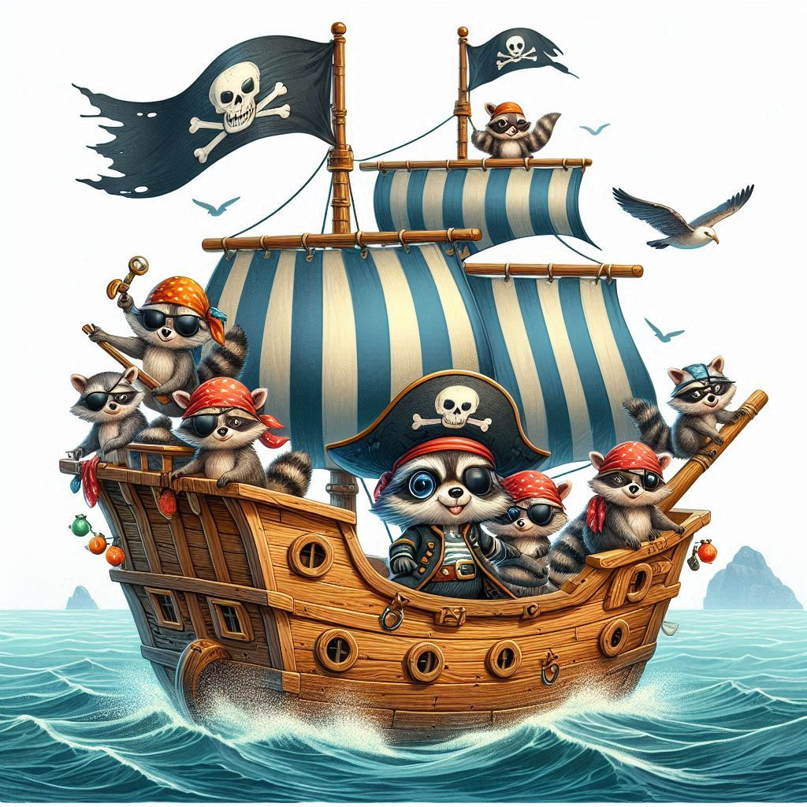

# Introduction 

Our pyrit-ship-tinker is a specialized fork for the Microsoft's PyRIT-Ship project, which has exposed a few PyRIT components through a flask app and then fed into a Burp Suite extension for automated AI security testing using BUrp Suite. It enables security researchers to conduct automated prompt injection testing through a custom extension-generated payload system.

This is a project fork for AI ProbeOffSec community (https://discord.gg/FsN225wC), for exploring future additions to the exposed PyRIT components and adding support for the Burp extension.

This project extends PyRIT's capabilities by integrating Azure OpenAI for intelligent prompt generation and mutation, providing a streamlined workflow for testing using burpsuite.

The repository currently contains:
- /pyritship : A Python Flax Server with some basic features of PyRIT exposed over API (prompt generator and scoring)
- /burp_extension : A Java extension for BURP Suite to use PyRIT from the **Intruder** module

# Getting Started - Setup & Build code
[PyRIT Ship Setup & Documentation](/docs/pyritship.md) \
[BURP Suite Extension Setup & Documentation](/docs/burp_extension.md)

# Demo running BURP Suite extension
[Attack Gandalf with PyRIT Ship](/docs/burp_gandalf_demo.md)
[Our Demostration of Attack Gandalf with PyRIT Ship](https://youtu.be/_WDM8TyKByA?si=YGQhfdfYDl7y-Opx) 

## Contributing

This project welcomes contributions and suggestions.  Most contributions require you to agree to a
Contributor License Agreement (CLA) declaring that you have the right to, and actually do, grant us
the rights to use your contribution. For details, visit https://cla.opensource.microsoft.com.

When you submit a pull request, a CLA bot will automatically determine whether you need to provide
a CLA and decorate the PR appropriately (e.g., status check, comment). Simply follow the instructions
provided by the bot. You will only need to do this once across all repos using our CLA.

This project has adopted the [Microsoft Open Source Code of Conduct](https://opensource.microsoft.com/codeofconduct/).
For more information see the [Code of Conduct FAQ](https://opensource.microsoft.com/codeofconduct/faq/) or
contact [opencode@microsoft.com](mailto:opencode@microsoft.com) with any additional questions or comments.

## Trademarks

This project may contain trademarks or logos for projects, products, or services. Authorized use of Microsoft 
trademarks or logos is subject to and must follow 
[Microsoft's Trademark & Brand Guidelines](https://www.microsoft.com/en-us/legal/intellectualproperty/trademarks/usage/general).
Use of Microsoft trademarks or logos in modified versions of this project must not cause confusion or imply Microsoft sponsorship.
Any use of third-party trademarks or logos are subject to those third-party's policies.
